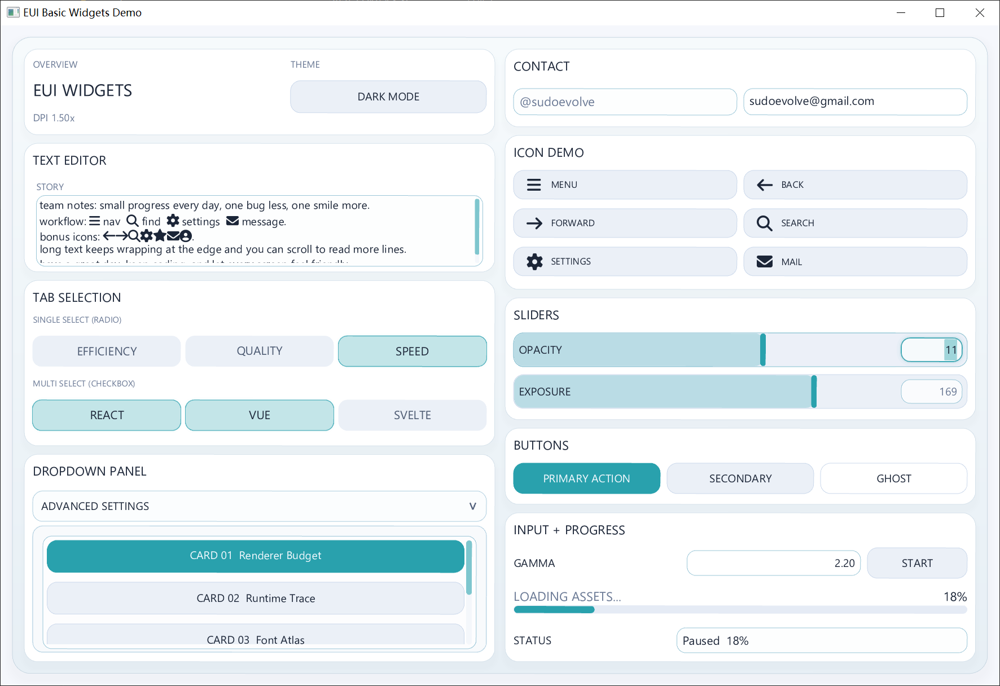
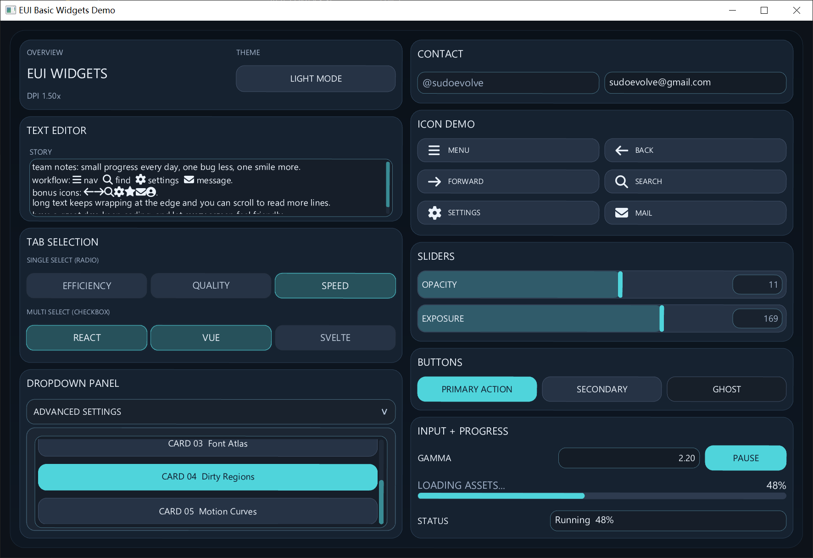

# EUI

Immediate-mode C++ UI toolkit with a unified OpenGL renderer path for `GLFW` and `SDL2`.

## Preview

<table>
  <tr>
    <td></td>
    <td></td>
    <td></td>
  </tr>
  <tr>
    <td></td>
    <td></td>
    <td></td>
  </tr>
</table>

## Docs

- `docs/quick-ui-tutorial.zh-CN.md`
- `docs/project-structure.zh-CN.md`
- `docs/README.md`

## Examples

- `examples/minimal_quick_demo.cpp`
- `examples/anchor_and_position_demo.cpp`
- `examples/image_texture_demo.cpp`
- `examples/EUI_gallery.cpp`

## EUI_gallery Runtime Assets

`examples/EUI_gallery.cpp` looks up its font and image assets at runtime. When you copy the built executable outside the repo, place the required files either next to the executable or under an `assets/` directory beside it.

Lookup order:

1. executable directory with filename only, for example `0.jpg`
2. executable directory with the original relative path, for example `preview/0.jpg`
3. `assets/` with filename only, for example `assets/0.jpg`
4. `assets/` with the original relative path, for example `assets/preview/0.jpg`
5. repo-relative fallback when running from the source tree

Files used by `EUI_gallery`:

- `Font Awesome 7 Free-Solid-900.otf`
- `0.jpg`
- `1.jpg`
- `2.jpg`
- `3.jpg`
- `4.jpg`
- `avtar.jpg`
- `EUI_gallery_icons.json`
