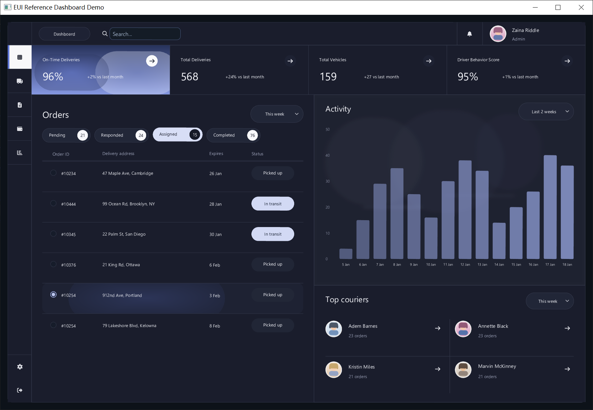
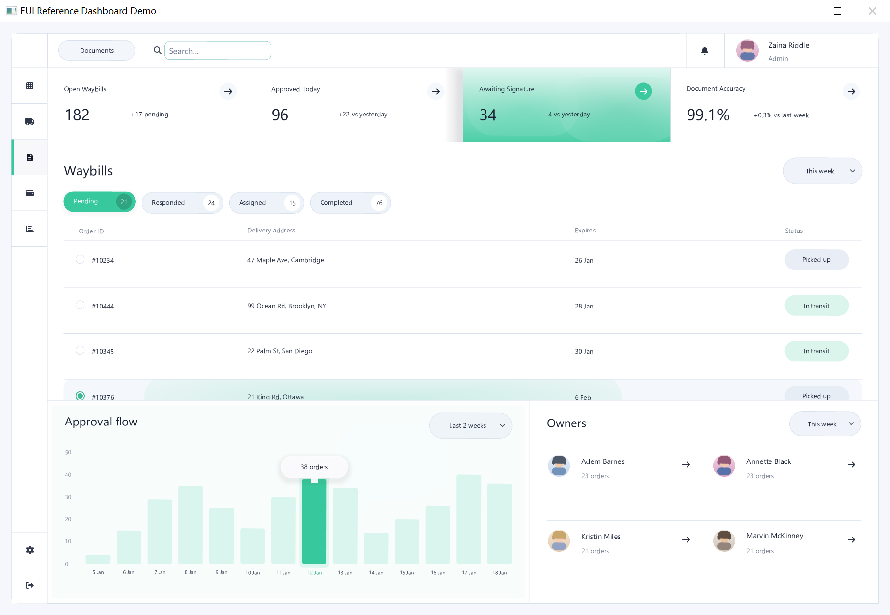
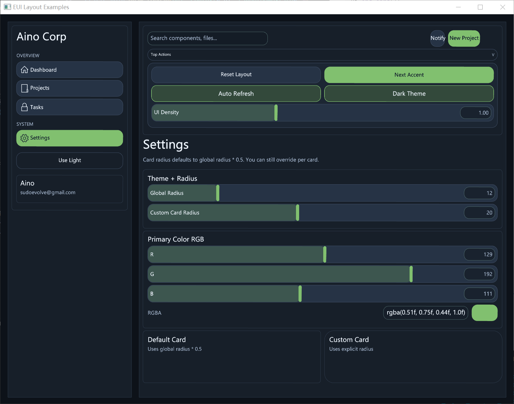

# EUI

[中文说明](readme.zh-CN.md)

EUI is a lightweight, header-only C++ UI toolkit focused on practical immediate-mode workflows.
The core API in `include/EUI.h` generates draw commands only.
A GLFW + OpenGL demo runtime is available when `EUI_ENABLE_GLFW_OPENGL_BACKEND` is enabled.

## Preview

<table>
  <tr>
    <td width="50%"></td>
    <td width="50%"></td>
  </tr>
  <tr>
    <td width="50%"></td>
    <td width="50%"></td>
  </tr>
</table>

## Project Analysis (Current Code)

### 1) Architecture

- **Core layer (`eui::Context`)**
  - Immediate-mode UI API that emits `DrawCommand` + text arena.
  - No hard dependency on GLFW/OpenGL for core usage.
- **Optional demo runtime (`eui::demo`)**
  - Window/input loop, DPI extraction, clipboard bridge, frame scheduling.
  - Calls your UI builder callback with `FrameContext`.
- **Renderer layer (inside `EUI.h`)**
  - OpenGL command renderer with clipping and batching.
  - Win32 path uses GDI/wgl glyph lists for font rendering (text + icon fallback).
  - Non-Windows path includes a built-in bitmap-font fallback path.

### 2) Rendering Pipeline

1. `ui.begin_frame(...)`
2. Build UI widgets and layout.
3. `ui.take_frame(...)` gets command buffer + text arena.
4. Runtime hashes frame payload.
5. If unchanged, skip redraw.
6. If changed, compute dirty regions vs previous frame.
7. Repaint only dirty scissor regions; reuse cached framebuffer texture for the rest.

### 3) Performance Mechanisms Already Implemented

- Event-driven rendering (`continuous_render = false` by default).
- Frame hash early-out to avoid redundant GPU work.
- Dirty-region diff between previous and current draw command streams.
- Cached framebuffer texture + partial redraw via scissor.
- Clip stack + command clipping in core.
- Tile-assisted command bucketing for large command counts.

## Implemented Features

### Theme

- `ThemeMode` (`Light` / `Dark`)
- Primary color (`set_primary_color`)
- Corner radius (`set_corner_radius`)
- Dark mode auto-lifts too-dark primary colors for better contrast

### Layout

- `begin_panel` / `end_panel`
- `begin_card` / `end_card`
- `begin_row` / `end_row`
- `begin_columns` / `end_columns`
- `begin_waterfall` / `end_waterfall`
- `spacer`
- `row_skip` / `row_flex_spacer`
- `set_next_item_span`

### Widgets

- `label`
- `button` (`Primary`, `Secondary`, `Ghost`)
- `tab`
- `slider_float` (drag + right-click numeric edit)
- `input_float` (caret, selection, `Ctrl+A/C/V/X`)
- `input_text` (single-line editable text input)
- `input_readonly`
  - supports `align_right`, `value_font_scale`, `muted`
- `progress`
- `begin_dropdown` / `end_dropdown`
- `begin_scroll_area` / `end_scroll_area`
  - drag, wheel, inertia, overscroll bounce, scrollbar options
- `text_area` (editable, selection, caret, scrolling)
- `text_area_readonly`

### Output / Integration

- `end_frame()` returns `std::vector<DrawCommand>`
- `take_frame(...)` for moving frame buffers out efficiently
- `text_arena()` returns text storage used by text commands

## Repository Layout

```text
EUI/
|- include/
|  `- EUI.h
|- examples/
|  |- basic_demo.cpp
|  |- calculator_demo.cpp
|  `- layout_examples_demo.cpp
|- CMakeLists.txt
|- index.html
|- readme.md
`- readme.zh-CN.md
```

## Build

Recommended generator: `Ninja`.

### 1) Build core only (no GLFW required)

```bash
cmake -S . -B build -G Ninja -DEUI_BUILD_EXAMPLES=OFF
cmake --build build
```

Targets:

- `EUI::eui` (interface)

### 2) Build demos (GLFW + OpenGL)

```bash
cmake -S . -B build -G Ninja -DEUI_BUILD_EXAMPLES=ON
cmake --build build
```

When OpenGL + GLFW are available, CMake creates:

- `eui_demo` (`examples/basic_demo.cpp`)
- `eui_calculator_demo` (`examples/calculator_demo.cpp`)
- `eui_layout_examples_demo` (`examples/layout_examples_demo.cpp`)

Important options:

```bash
-DEUI_BUILD_EXAMPLES=ON|OFF
-DEUI_STRICT_WARNINGS=ON|OFF
-DEUI_FETCH_GLFW_FROM_GIT=ON|OFF
-DEUI_GLFW_GIT_TAG=3.4
```

If network/Git access is restricted:

```bash
cmake -S . -B build -G Ninja -DEUI_BUILD_EXAMPLES=ON -DEUI_FETCH_GLFW_FROM_GIT=OFF
```

## Run Examples

```bash
# core demo
cmake --build build --target eui_demo

# calculator demo
cmake --build build --target eui_calculator_demo

# layout examples demo
cmake --build build --target eui_layout_examples_demo
```

## Minimal Core Usage

```cpp
#include "EUI.h"

eui::Context ui;
eui::InputState input{};

float value = 0.5f;
bool advanced_open = false;

ui.begin_frame(1280.0f, 720.0f, input);
ui.begin_panel("Demo", 20.0f, 20.0f, 640.0f);

ui.begin_row(2, 8.0f);
ui.button("Run", eui::ButtonStyle::Primary);
ui.input_float("Value", value, 0.0f, 1.0f, 2);
ui.end_row();

if (ui.begin_dropdown("Advanced", advanced_open, 80.0f)) {
    ui.progress("Loading", 0.42f);
    ui.end_dropdown();
}

ui.end_panel();

const auto& commands = ui.end_frame();
const auto& text_arena = ui.text_arena();
```

## Common Layout Recipes

### Width Rules (Important)

- Item width is controlled by layout, not widget args.
- `begin_row(n, gap)` gives `n` equal-width columns.
- `set_next_item_span(k)` lets the next control span `k` columns.
- Use `row_flex_spacer(keep_trailing_columns)` to push right-side controls.
- Use `row_skip(k)` to skip fixed columns.

### Sidebar Icon/Text Vertical Alignment

- For left-aligned sidebar buttons, prefix label with `\t` to enable left align with built-in left padding.
- For icon + text, use **two ASCII spaces** between them (for example `u8"\uE80F  Dashboard"`).
- EUI will split icon/text and render them separately, which keeps vertical alignment stable.

```cpp
// Left-aligned nav item with icon + text (stable vertical centering)
ui.button("\t" u8"\uE80F  Dashboard", eui::ButtonStyle::Secondary, 34.0f);
```

### 1) Sidebar + Main Content

```cpp
const float pad = 16.0f;
const float sidebar_w = 220.0f;

ui.begin_panel("NAV", pad, pad, sidebar_w);
ui.button("Dashboard");
ui.button("Projects");
ui.button("Settings");
ui.end_panel();

ui.begin_panel("MAIN",
               pad * 2.0f + sidebar_w,
               pad,
               frame_w - sidebar_w - pad * 3.0f);
ui.begin_card("Overview");
ui.label("Main content area");
ui.end_card();
ui.end_panel();
```

### 2) Top Bar (Left / Right)

```cpp
ui.begin_card("TOPBAR", 0.0f, 10.0f);
ui.begin_row(8, 8.0f);
ui.button("Back");
ui.button("Forward");
ui.row_flex_spacer(2, 34.0f); // keep last 2 columns on the right
ui.button("Search");
ui.button("Profile");
ui.end_row();
ui.end_card();
```

### 3) Three-Zone Toolbar (Left / Center / Right)

```cpp
ui.begin_card("TOOLBAR");
ui.begin_row(12, 8.0f);
ui.button("New");
ui.button("Save");
ui.row_skip(2);               // leave center breathing space
ui.label("Build #128", 13.0f, true);
ui.row_flex_spacer(2, 34.0f); // keep right-side actions
ui.button("Run");
ui.button("Deploy");
ui.end_row();
ui.end_card();
```

### 4) Two-Column Settings Page

```cpp
ui.begin_waterfall(2, 10.0f); // equal 2 columns

ui.begin_card("General");
ui.input_float("Gamma", gamma, 0.1f, 4.0f, 2);
ui.end_card();

ui.begin_card("Display");
ui.slider_float("Exposure", exposure, 0.0f, 255.0f, 0);
ui.end_card();

ui.end_waterfall();
```

## Optional Demo Runtime Usage

```cpp
#define EUI_ENABLE_GLFW_OPENGL_BACKEND 1
#include "EUI.h"

int main() {
    eui::demo::AppOptions options{};
    options.width = 960;
    options.height = 710;
    options.title = "EUI Demo";
    options.vsync = true;
    options.continuous_render = false;
    options.max_fps = 240.0;

    options.text_font_family = "Segoe UI";
    options.text_font_weight = 600; // 100-900, larger = bolder
    options.icon_font_family = "Segoe MDL2 Assets";
    options.enable_icon_font_fallback = true;

    return eui::demo::run(
        [&](eui::demo::FrameContext frame) {
            auto& ui = frame.ui;
            ui.set_theme_mode(eui::ThemeMode::Dark);

            ui.begin_panel("Demo", 20.0f, 20.0f, 320.0f);
            ui.label("Hello EUI");
            ui.end_panel();

            // request_next_frame() if animation is needed in event-driven mode.
            frame.request_next_frame();
        },
        options
    );
}
```

## Notes

- `index.html` is a visual/prototype reference, not part of C++ build output.
- Keep source files in UTF-8 to avoid C4819/garbled literal issues on Windows toolchains.
